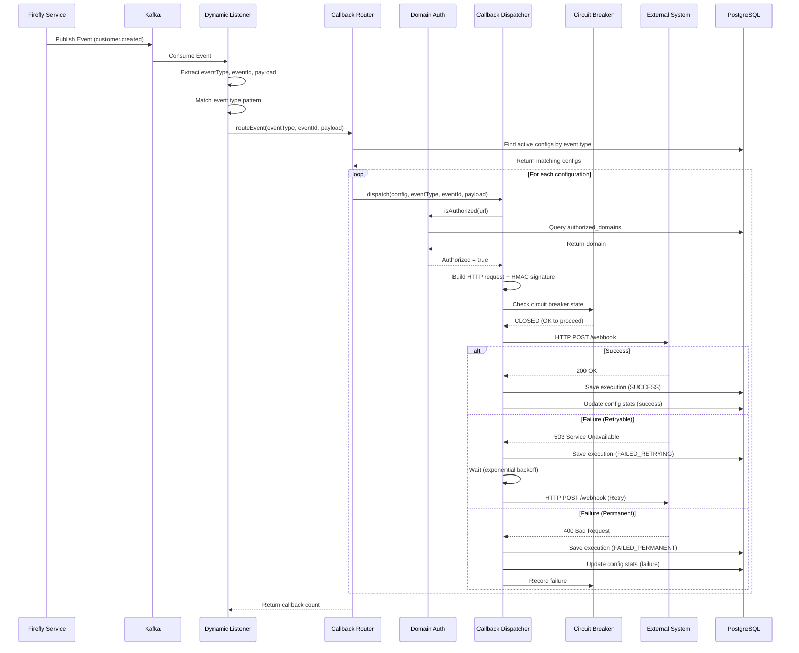

# Architecture Deep Dive

> **Comprehensive architectural documentation for the Firefly Callback Management Platform**

## Table of Contents

- [Overview](#overview)
- [System Architecture](#system-architecture)
- [Core Components](#core-components)
- [Data Model](#data-model)
- [Event Flow](#event-flow)
- [Design Patterns](#design-patterns)
- [Security Architecture](#security-architecture)
- [Resilience Patterns](#resilience-patterns)
- [Performance Considerations](#performance-considerations)
- [Configuration Reference](#configuration-reference)

## Overview

The Firefly Callback Management Platform is a **reactive, event-driven microservice** that bridges Firefly's internal event bus (Kafka) with external HTTP webhooks. It provides a complete solution for:

1. **Dynamic Event Subscription**: Subscribe to Kafka topics at runtime via REST API
2. **Intelligent Event Routing**: Route events to multiple HTTP endpoints based on patterns
3. **Reliable Delivery**: Circuit breakers, retries, and comprehensive execution tracking
4. **Security**: Domain authorization, HMAC signatures, HTTPS enforcement
5. **Observability**: Metrics, health checks, and execution audit trails

### Key Design Principles

- **Reactive First**: Non-blocking I/O throughout the stack (WebFlux, R2DBC, WebClient)
- **Event-Driven**: Asynchronous event processing with backpressure support
- **Resilient**: Circuit breakers, retries, timeouts, and graceful degradation
- **Secure**: Defense-in-depth with domain whitelisting and signature verification
- **Observable**: Comprehensive metrics, logging, and execution tracking
- **Extensible**: Plugin architecture for new messaging systems and filters

## System Architecture

### High-Level Architecture

```
┌─────────────────────────────────────────────────────────────────────────┐
│                              Firefly Ecosystem                          │
│         ┌──────────────┐  ┌──────────────┐  ┌──────────────┐            │
│         │   Customer   │  │     Loan     │  │   Payment    │            │
│         │  Management  │  │  Management  │  │  Management  │            │
│         └──────┬───────┘  └──────┬───────┘  └──────┬───────┘            │
│                │                 │                 │                    │
│                └─────────────────┴─────────────────┘                    │
│                                  │                                      │
│                                  ▼                                      │
│                         ┌─────────────────┐                             │
│                         │  Apache Kafka   │                             │
│                         │  Event Streams  │                             │
│                         └────────┬────────┘                             │
└──────────────────────────────────┼──────────────────────────────────────┘
                                   ▼
┌─────────────────────────────────────────────────────────────────────────┐
│              Callback Management Platform (This Service)                │
│                                                                         │
│  ┌────────────────────────────────────────────────────────────────┐     │
│  │                      Web Layer (WebFlux)                       │     │
│  │  ┌──────────────┐  ┌──────────────┐  ┌──────────────┐          │     │
│  │  │ Subscription │  │   Domain     │  │  Callback    │          │     │
│  │  │ Controller   │  │ Controller   │  │ Controller   │          │     │
│  │  └──────┬───────┘  └───────┬──────┘  └────────┬─────┘          │     │
│  └─────────┼──────────────────┼──────────────────┼────────────────┘     │
│            │                  │                  │                      │
│  ┌─────────┼──────────────────┼──────────────────┼────────────────┐     │
│  │         │      Service Layer (Business Logic)  │               │     │
│  │         ▼                  ▼                  ▼                │     │
│  │  ┌──────────────┐  ┌──────────────┐  ┌──────────────┐          │     │
│  │  │ Subscription │  │ Authorization│  │Configuration │          │     │
│  │  │   Service    │  │   Service    │  │   Service    │          │     │
│  │  └──────┬───────┘  └───────┬──────┘  └────────┬─────┘          │     │
│  └─────────┼──────────────────┼──────────────────┼────────────────┘     │
│            │                  │                  │                      │
│  ┌─────────┼──────────────────┼──────────────────┼────────────────┐     │
│  │         │      Event Processing Layer         │                │     │
│  │         ▼                  │                  │                │     │
│  │  ┌──────────────┐          │                  │                │     │
│  │  │   Dynamic    │          │                  │                │     │
│  │  │   Listener   │──────────┼──────────────────┘                │     │
│  │  │   Factory    │          │                                   │     │
│  │  └──────┬───────┘          │                                   │     │
│  │         │                  │                                   │     │
│  │         ▼                  │                                   │     │
│  │  ┌──────────────┐          │                                   │     │
│  │  │   Callback   │◀─────────┘                                   │     │
│  │  │    Router    │                                              │     │
│  │  └──────┬───────┘                                              │     │
│  │         │                                                      │     │
│  │         ▼                                                      │     │
│  │  ┌──────────────┐                                              │     │
│  │  │   Callback   │                                              │     │
│  │  │  Dispatcher  │                                              │     │
│  │  │ (Circuit     │                                              │     │
│  │  │  Breaker +   │                                              │     │
│  │  │  Retry)      │                                              │     │
│  │  └──────┬───────┘                                              │     │
│  └─────────┼──────────────────────────────────────────────────────┘     │
│            │                                                            │
│  ┌─────────┼──────────────────────────────────────────────────────┐     │
│  │         │         Data Layer (R2DBC)                           │     │
│  │         ▼                                                      │     │
│  │  ┌──────────────────────────────────────────────────┐          │     │
│  │  │              PostgreSQL Database                 │          │     │
│  │  │  ┌────────────┐  ┌────────────┐  ┌────────────┐  │          │     │
│  │  │  │Subscriptions│ │  Domains   │  │  Configs   │  │          │     │
│  │  │  └────────────┘  └────────────┘  └────────────┘  │          │     │
│  │  │  ┌────────────┐                                  │          │     │
│  │  │  │ Executions │                                  │          │     │
│  │  │  └────────────┘                                  │          │     │
│  │  └──────────────────────────────────────────────────┘          │     │
│  └────────────────────────────────────────────────────────────────┘     │
└──────────────────────────┬──────────────────────────────────────────────┘
                           │ HTTP Callbacks
                           ▼
┌─────────────────────────────────────────────────────────────────────────┐
│                      External Systems                                   │
│  ┌──────────────┐  ┌──────────────┐  ┌──────────────┐                   │
│  │     CRM      │  │  Analytics   │  │   Webhooks   │                   │
│  │  (Salesforce)│  │  (Segment)   │  │   (Custom)   │                   │
│  └──────────────┘  └──────────────┘  └──────────────┘                   │
└─────────────────────────────────────────────────────────────────────────┘
```

### Module Structure

The platform follows a **multi-module Maven architecture** for clear separation of concerns:

```
common-platform-callbacks-mgmt/
│
├── interfaces/          # API Contracts (DTOs, Enums)
│   ├── dto/            # Data Transfer Objects
│   │   ├── EventSubscriptionDTO
│   │   ├── AuthorizedDomainDTO
│   │   ├── CallbackConfigurationDTO
│   │   └── CallbackExecutionDTO
│   └── enums/          # Enumerations
│       ├── CallbackStatus
│       ├── CallbackExecutionStatus
│       └── HttpMethod
│
├── models/             # Data Layer (Entities, Repositories)
│   ├── entity/         # R2DBC Entities
│   │   ├── EventSubscription
│   │   ├── AuthorizedDomain
│   │   ├── CallbackConfiguration
│   │   └── CallbackExecution
│   ├── repository/     # R2DBC Repositories
│   │   ├── BaseRepository
│   │   ├── EventSubscriptionRepository
│   │   ├── AuthorizedDomainRepository
│   │   ├── CallbackConfigurationRepository
│   │   └── CallbackExecutionRepository
│   └── db/migration/   # Flyway Migrations
│       └── V1__create_callback_tables.sql
│
├── core/               # Business Logic
│   ├── filters/        # Generic Filtering System
│   │   ├── FilterRequest
│   │   ├── FilterUtils
│   │   └── PaginationResponse
│   ├── listener/       # Event Listeners
│   │   ├── DynamicListenerFactory
│   │   └── DynamicEventListenerRegistry
│   ├── mapper/         # MapStruct Mappers
│   │   ├── EventSubscriptionMapper
│   │   ├── AuthorizedDomainMapper
│   │   ├── CallbackConfigurationMapper
│   │   └── CallbackExecutionMapper
│   └── service/        # Services
│       ├── EventSubscriptionService
│       ├── DomainAuthorizationService
│       ├── CallbackConfigurationService
│       ├── CallbackRouter
│       └── CallbackDispatcher
│
├── web/                # REST API & Configuration
│   ├── config/         # Spring Configuration
│   ├── controller/     # REST Controllers
│   │   ├── EventSubscriptionController
│   │   ├── AuthorizedDomainController
│   │   ├── CallbackConfigurationController
│   │   └── CallbackExecutionController
│   └── resources/
│       └── application.yml
│
└── sdk/                # Client SDK (Future)
```

### Technology Stack

| Layer | Technology | Purpose |
|-------|-----------|---------|
| **Web** | Spring WebFlux | Reactive web framework |
| **Reactive** | Project Reactor | Reactive programming (Mono/Flux) |
| **Database** | R2DBC + PostgreSQL | Reactive database access |
| **Messaging** | Apache Kafka | Event streaming |
| **EDA** | lib-common-eda | Firefly's event library |
| **HTTP Client** | WebClient | Non-blocking HTTP calls |
| **Resilience** | Resilience4j | Circuit breaker, retry |
| **Mapping** | MapStruct | DTO-Entity mapping |
| **Validation** | Jakarta Validation | Bean validation |
| **Migrations** | Flyway | Database versioning |
| **Metrics** | Micrometer + Prometheus | Observability |
| **Testing** | Testcontainers | Integration testing |

## Core Components

### 1. Dynamic Listener Factory

**Purpose**: Dynamically creates Kafka listeners based on database configuration without requiring application restart.

**Location**: `com.firefly.common.callbacks.core.listener.DynamicListenerFactory`

**How It Works**:

```java
@Component
public class DynamicListenerFactory {

    private final CallbackRouter callbackRouter;
    private final DynamicEventListenerRegistry listenerRegistry;

    /**
     * Registers a single subscription as a dynamic listener.
     * Called when subscriptions are created via EventSubscriptionService.
     */
    public void registerSubscription(EventSubscriptionDTO subscription) {
        if (!"KAFKA".equalsIgnoreCase(subscription.getMessagingSystemType())) {
            return; // Only Kafka supported currently
        }

        // Register listener using lib-common-eda's registry
        listenerRegistry.registerListener(
            subscription.getId().toString(),
            subscription.getTopicOrQueue(),
            subscription.getEventTypePatterns() != null ? subscription.getEventTypePatterns() : new String[0],
            PublisherType.AUTO,
            (event, headers) -> handleEvent(event, headers, subscription)
        );
    }

    /**
     * Unregisters a subscription's dynamic listener.
     */
    public void unregisterSubscription(UUID subscriptionId) {
        listenerRegistry.unregisterListener(subscriptionId.toString());
    }
}
```

**Key Features**:
- Loads subscriptions from database on startup
- Registers listeners with `lib-common-eda`
- Supports runtime registration when new subscriptions are created
- Handles event type pattern matching (`customer.*`, `order.completed`)

### 2. Callback Router

**Purpose**: Routes incoming events to matching callback configurations.

**Location**: `com.firefly.common.callbacks.core.service.impl.CallbackRouterImpl`

**Routing Logic**:

```java
public Mono<Integer> routeEvent(
        String eventType,
        UUID eventId,
        JsonNode payload,
        Map<String, Object> headers) {

    // Find all active callbacks subscribed to this event type
    return configurationService.findActiveByEventType(eventType)
        .flatMap(config -> {
            // Apply filter expression if configured
            if (matchesFilter(config, payload)) {
                return callbackDispatcher.dispatch(
                    config, eventType, eventId, payload
                );
            }
            return Mono.empty();
        })
        .count()
        .map(Long::intValue);
}
```

**Features**:
- Event type matching with PostgreSQL array queries
- Filter expression evaluation (JSONPath)
- Parallel callback execution
- Error isolation (one failure doesn't affect others)

### 3. Callback Dispatcher

**Purpose**: Executes HTTP callbacks with retry logic, circuit breakers, and HMAC signing.

**Location**: `com.firefly.common.callbacks.core.service.impl.CallbackDispatcherImpl`

**Execution Flow**:

```
1. Domain Authorization Check
   ├─ Extract domain from URL
   ├─ Query authorized_domains table
   └─ Verify active and verified status

2. Build HTTP Request
   ├─ Serialize payload to JSON
   ├─ Add standard headers (X-Event-Type, X-Event-Id, X-Timestamp)
   ├─ Add custom headers from configuration
   └─ Generate HMAC signature (if enabled)

3. Execute with Resilience
   ├─ Apply circuit breaker (per-configuration)
   ├─ Execute HTTP request via WebClient
   ├─ Apply timeout
   └─ Retry on failure (exponential backoff)

4. Record Execution
   ├─ Save to callback_executions table
   ├─ Update configuration statistics
   └─ Update domain statistics
```

**Circuit Breaker Configuration**:

```java
CircuitBreakerConfig config = CircuitBreakerConfig.custom()
    .failureRateThreshold(50)              // Open after 50% failures
    .waitDurationInOpenState(Duration.ofSeconds(30))
    .slidingWindowSize(10)                 // Last 10 calls
    .build();
```

**Retry Configuration**:

```java
RetryBackoffSpec retrySpec = Retry.backoff(
    maxRetries,                            // From configuration
    Duration.ofMillis(retryDelayMs)        // Initial delay
)
.maxBackoff(Duration.ofSeconds(30))        // Max delay
.filter(throwable -> shouldRetry(throwable)); // Retry on 5xx, 408, 429
```

### 4. Domain Authorization Service

**Purpose**: Validates callback URLs against a whitelist of authorized domains.

**Location**: `com.firefly.common.callbacks.core.service.impl.DomainAuthorizationServiceImpl`

**Authorization Flow**:

```java
public Mono<Boolean> isAuthorized(String url) {
    String domain = extractDomain(url);

    return domainRepository.findByDomain(domain)
        .map(authorizedDomain ->
            authorizedDomain.getActive() &&
            authorizedDomain.getVerified()
        )
        .defaultIfEmpty(false);
}
```

**Security Features**:
- Domain extraction from URLs
- Active and verified status checks
- HTTPS enforcement (configurable)
- Path restrictions (e.g., only `/webhooks/*`)
- Rate limiting (per domain)
- IP whitelisting

### 5. Generic Filtering System

**Purpose**: Provides unified filtering, pagination, and sorting across all entities.

**Location**: `com.firefly.common.callbacks.core.filters.*`

**FilterRequest Structure**:

```java
public class FilterRequest<T> {
    private Integer page = 0;              // 0-indexed
    private Integer size = 20;             // Page size
    private List<String> sort;             // ["field,direction"]
    private Map<String, Object> filters;   // Field-value pairs
    private String search;                 // Full-text search
}
```

**Usage Example**:

```java
// In service layer
public Mono<PaginationResponse<CallbackConfigurationDTO>> filterConfigurations(
        FilterRequest<CallbackConfigurationDTO> request) {

    return FilterUtils
        .createFilter(CallbackConfiguration.class, mapper::toDto)
        .withRepository(configurationRepository)
        .filter(request);
}
```

**PaginationResponse Structure**:

```java
public class PaginationResponse<T> {
    private List<T> content;               // Page content
    private Integer page;                  // Current page
    private Integer size;                  // Page size
    private Long totalElements;            // Total count
    private Integer totalPages;            // Total pages
    private Boolean first;                 // Is first page
    private Boolean last;                  // Is last page
    private Integer numberOfElements;      // Elements in current page
    private Boolean empty;                 // Is empty
}
```

## Data Model

### Entity Relationship Diagram

```
┌─────────────────────────┐
│  event_subscriptions    │
│─────────────────────────│
│ id (PK)                 │
│ name                    │
│ messaging_system_type   │
│ topic_or_queue          │
│ event_type_patterns[]   │
│ active                  │
│ ...                     │
└─────────────────────────┘
           │
           │ (Triggers dynamic listener creation)
           │
           ▼
┌─────────────────────────┐
│ callback_configurations │
│─────────────────────────│
│ id (PK)                 │
│ name                    │
│ url                     │──────┐
│ subscribed_event_types[]│      │
│ status                  │      │ (Must match)
│ max_retries             │      │
│ ...                     │      │
└────────┬────────────────┘      │
         │                       │
         │ (1:N)                 │
         │                       │
         ▼                       ▼
┌─────────────────────────┐  ┌──────────────────┐
│  callback_executions    │  │authorized_domains│
│─────────────────────────│  │──────────────────│
│ id (PK)                 │  │ id (PK)          │
│ configuration_id (FK)   │  │ domain (UNIQUE)  │
│ event_type              │  │ verified         │
│ status                  │  │ active           │
│ request_payload         │  │ ...              │
│ response_status_code    │  └──────────────────┘
│ attempt_number          │
│ ...                     │
└─────────────────────────┘
```

### Table Schemas

#### event_subscriptions

Stores dynamic subscriptions to messaging systems (Kafka, RabbitMQ, etc.).

```sql
CREATE TABLE event_subscriptions (
    id UUID PRIMARY KEY DEFAULT gen_random_uuid(),
    name VARCHAR(255) NOT NULL,
    description TEXT,
    messaging_system_type VARCHAR(50) NOT NULL,  -- KAFKA, RABBITMQ, SQS, etc.
    connection_config TEXT,                      -- JSON config
    topic_or_queue VARCHAR(500) NOT NULL,
    consumer_group_id VARCHAR(255),
    active BOOLEAN NOT NULL DEFAULT TRUE,
    consumer_properties TEXT,                    -- JSON config
    event_type_patterns TEXT[],                  -- ['customer.*', 'order.completed']
    max_concurrent_consumers INTEGER DEFAULT 1,
    polling_interval_ms INTEGER DEFAULT 1000,
    tenant_id VARCHAR(100),
    metadata TEXT,                               -- JSON metadata
    last_message_at TIMESTAMP,
    total_messages_received BIGINT DEFAULT 0,
    total_messages_failed BIGINT DEFAULT 0,
    created_at TIMESTAMP NOT NULL DEFAULT CURRENT_TIMESTAMP,
    updated_at TIMESTAMP NOT NULL DEFAULT CURRENT_TIMESTAMP,
    created_by VARCHAR(255),
    updated_by VARCHAR(255)
);
```

**Field Validations**:
- `name`: Required, 1-255 characters
- `messaging_system_type`: Required, 1-50 characters
- `connection_config`: Required, must contain at least one entry
- `topic_or_queue`: Required, 1-500 characters
- `consumer_group_id`: Optional, max 255 characters
- `max_concurrent_consumers`: 1-100, default 1
- `polling_interval_ms`: 100-60000ms, default 1000ms
- `tenant_id`: Optional, max 100 characters

**Indexes**:
- `idx_event_subs_active` on `active`
- `idx_event_subs_tenant` on `tenant_id`

#### authorized_domains

Whitelist of domains authorized to receive callbacks.

```sql
CREATE TABLE authorized_domains (
    id UUID PRIMARY KEY DEFAULT gen_random_uuid(),
    domain VARCHAR(255) NOT NULL UNIQUE,
    organization VARCHAR(255),
    contact_email VARCHAR(255),
    verified BOOLEAN NOT NULL DEFAULT FALSE,
    verification_method VARCHAR(50),
    verification_token VARCHAR(500),
    verified_at TIMESTAMP,
    active BOOLEAN NOT NULL DEFAULT TRUE,
    allowed_paths TEXT[],                        -- ['/webhooks/*', '/api/callbacks/*']
    max_callbacks_per_minute INTEGER DEFAULT 100,
    ip_whitelist TEXT[],
    require_https BOOLEAN DEFAULT TRUE,
    tenant_id VARCHAR(100),
    notes TEXT,
    metadata TEXT,                               -- JSON metadata
    expires_at TIMESTAMP,
    last_callback_at TIMESTAMP,
    total_callbacks BIGINT DEFAULT 0,
    total_failed BIGINT DEFAULT 0,
    created_at TIMESTAMP NOT NULL DEFAULT CURRENT_TIMESTAMP,
    updated_at TIMESTAMP NOT NULL DEFAULT CURRENT_TIMESTAMP,
    authorized_by VARCHAR(255)
);
```

**Field Validations**:
- `domain`: Required, 1-255 characters
- `organization`: Optional, max 255 characters
- `contact_email`: Optional, must be valid email, max 255 characters
- `verification_method`: Optional, max 50 characters
- `verification_token`: Optional, max 500 characters
- `max_callbacks_per_minute`: 1-10000, default 100
- `tenant_id`: Optional, max 100 characters
- `notes`: Optional, max 2000 characters

**Indexes**:
- `idx_auth_domains_domain` on `domain`
- `idx_auth_domains_active_verified` on `(active, verified)`

#### callback_configurations

HTTP callback configurations for webhook dispatch.

```sql
CREATE TABLE callback_configurations (
    id UUID PRIMARY KEY DEFAULT gen_random_uuid(),
    name VARCHAR(255) NOT NULL,
    description TEXT,
    url VARCHAR(2048) NOT NULL,
    http_method VARCHAR(10) NOT NULL DEFAULT 'POST',
    status VARCHAR(50) NOT NULL DEFAULT 'ACTIVE',
    subscribed_event_types TEXT[] NOT NULL,      -- ['customer.created', 'customer.updated']
    custom_headers TEXT,                         -- JSON
    secret VARCHAR(500),
    signature_enabled BOOLEAN DEFAULT FALSE,
    signature_header VARCHAR(100) DEFAULT 'X-Firefly-Signature',
    max_retries INTEGER DEFAULT 3,
    retry_delay_ms INTEGER DEFAULT 1000,
    retry_backoff_multiplier DOUBLE PRECISION DEFAULT 2.0,
    timeout_ms INTEGER DEFAULT 30000,
    active BOOLEAN NOT NULL DEFAULT TRUE,
    tenant_id VARCHAR(100),
    filter_expression TEXT,                      -- JSONPath expression
    metadata TEXT,                               -- JSON metadata
    failure_threshold INTEGER DEFAULT 10,
    failure_count INTEGER DEFAULT 0,
    last_success_at TIMESTAMP,
    last_failure_at TIMESTAMP,
    created_at TIMESTAMP NOT NULL DEFAULT CURRENT_TIMESTAMP,
    updated_at TIMESTAMP NOT NULL DEFAULT CURRENT_TIMESTAMP,
    created_by VARCHAR(255),
    updated_by VARCHAR(255)
);
```

**Field Validations**:
- `name`: Required, 1-255 characters
- `description`: Optional, max 2000 characters
- `url`: Required, max 2048 characters, must start with http:// or https://
- `http_method`: Required, one of POST, PUT, PATCH
- `status`: Required, one of ACTIVE, PAUSED, DISABLED, FAILED
- `subscribed_event_types`: Required, must contain at least one event type
- `secret`: Optional, max 500 characters
- `signature_header`: Optional, max 100 characters
- `max_retries`: 0-10, default 3
- `retry_delay_ms`: 100-300000ms, default 1000ms
- `retry_backoff_multiplier`: 1.0-10.0, default 2.0
- `timeout_ms`: 1000-300000ms, default 30000ms
- `tenant_id`: Optional, max 100 characters
- `filter_expression`: Optional, max 1000 characters
- `failure_threshold`: 1-100, default 10
- `failure_count`: Non-negative, default 0

**Indexes**:
- `idx_callback_configs_status` on `status`
- `idx_callback_configs_active` on `active`
- `idx_callback_configs_event_types` (GIN) on `subscribed_event_types`

#### callback_executions

Audit trail of all callback execution attempts.

```sql
CREATE TABLE callback_executions (
    id UUID PRIMARY KEY DEFAULT gen_random_uuid(),
    configuration_id UUID NOT NULL REFERENCES callback_configurations(id) ON DELETE CASCADE,
    event_type VARCHAR(255),
    source_event_id UUID,
    status VARCHAR(50) NOT NULL,                 -- PENDING, IN_PROGRESS, SUCCESS, FAILED_RETRYING, FAILED_PERMANENT, SKIPPED
    request_payload TEXT,                        -- JSON
    response_status_code INTEGER,
    response_body TEXT,
    request_headers TEXT,                        -- JSON
    response_headers TEXT,                       -- JSON
    attempt_number INTEGER NOT NULL DEFAULT 0,
    max_attempts INTEGER,
    error_message TEXT,
    error_stack_trace TEXT,
    request_duration_ms BIGINT,
    next_retry_at TIMESTAMP,
    executed_at TIMESTAMP NOT NULL DEFAULT CURRENT_TIMESTAMP,
    completed_at TIMESTAMP,
    metadata TEXT                                -- JSON metadata
);
```

**Field Validations**:
- `event_type`: Optional, max 255 characters
- `status`: Required, one of PENDING, IN_PROGRESS, SUCCESS, FAILED_RETRYING, FAILED_PERMANENT, SKIPPED
- `response_status_code`: 100-599 (valid HTTP status codes)
- `response_body`: Optional, max 10000 characters
- `attempt_number`: Non-negative, default 0
- `max_attempts`: 0-10
- `error_message`: Optional, max 2000 characters
- `error_stack_trace`: Optional, max 10000 characters
- `request_duration_ms`: Non-negative

**Indexes**:
- `idx_callback_exec_config` on `configuration_id`
- `idx_callback_exec_status` on `status`
- `idx_callback_exec_event_type` on `event_type`
- `idx_callback_exec_executed_at` on `executed_at DESC`


### Data Transfer Objects (DTOs)

All DTOs include comprehensive Jakarta validation annotations to ensure data integrity at the API boundary.

#### EventSubscriptionDTO

Represents a dynamic subscription to a messaging system.

**Key Fields**:
- `id` (UUID): Unique identifier (read-only)
- `name` (String, required): Subscription name (1-255 chars)
- `description` (String): Description (max 2000 chars)
- `messagingSystemType` (String, required): System type like KAFKA, RABBITMQ (1-50 chars)
- `connectionConfig` (Map<String,String>, required): Connection configuration (min 1 entry)
- `topicOrQueue` (String, required): Topic/queue name (1-500 chars)
- `consumerGroupId` (String): Consumer group ID (max 255 chars)
- `active` (Boolean): Whether subscription is active (default: true)
- `consumerProperties` (Map<String,String>): Additional consumer properties
- `eventTypePatterns` (String[]): Event type patterns to match
- `maxConcurrentConsumers` (Integer): Max concurrent consumers (1-100, default: 1)
- `pollingIntervalMs` (Integer): Polling interval (100-60000ms, default: 1000ms)
- `tenantId` (String): Tenant ID (max 100 chars)
- `metadata` (Map<String,Object>): Additional metadata
- `lastMessageAt` (Instant): Last message received time (read-only)
- `totalMessagesReceived` (Long): Total messages received (read-only, min: 0)
- `totalMessagesFailed` (Long): Total failed messages (read-only, min: 0)
- `createdAt`, `updatedAt` (Instant): Timestamps (read-only)
- `createdBy`, `updatedBy` (String): User tracking (max 255 chars, read-only)

#### CallbackConfigurationDTO

Represents an HTTP callback configuration.

**Key Fields**:
- `id` (UUID): Unique identifier (read-only)
- `name` (String, required): Configuration name (1-255 chars)
- `description` (String): Description (max 2000 chars)
- `url` (String, required): Target URL (max 2048 chars, must match `^https?://.*`)
- `httpMethod` (HttpMethod, required): HTTP method (POST, PUT, PATCH)
- `status` (CallbackStatus, required): Status (ACTIVE, PAUSED, DISABLED, FAILED)
- `subscribedEventTypes` (String[], required): Event types to subscribe to (min 1 entry)
- `customHeaders` (Map<String,String>): Custom HTTP headers
- `secret` (String): HMAC secret (max 500 chars)
- `signatureEnabled` (Boolean): Enable HMAC signature (default: false)
- `signatureHeader` (String): Signature header name (max 100 chars)
- `maxRetries` (Integer): Max retry attempts (0-10, default: 3)
- `retryDelayMs` (Integer): Initial retry delay (100-300000ms, default: 1000ms)
- `retryBackoffMultiplier` (Double): Backoff multiplier (1.0-10.0, default: 2.0)
- `timeoutMs` (Integer): Request timeout (1000-300000ms, default: 30000ms)
- `active` (Boolean): Whether callback is active (default: true)
- `tenantId` (String): Tenant ID (max 100 chars)
- `filterExpression` (String): JSONPath filter expression (max 1000 chars)
- `metadata` (Map<String,Object>): Additional metadata
- `failureThreshold` (Integer): Failures before auto-disable (1-100, default: 10)
- `failureCount` (Integer): Current failure count (read-only, min: 0)
- `lastSuccessAt`, `lastFailureAt` (Instant): Last execution times (read-only)
- `createdAt`, `updatedAt` (Instant): Timestamps (read-only)
- `createdBy`, `updatedBy` (String): User tracking (max 255 chars, read-only)

#### AuthorizedDomainDTO

Represents an authorized domain for callback URLs.

**Key Fields**:
- `id` (UUID): Unique identifier (read-only)
- `domain` (String, required): Domain name (1-255 chars)
- `organization` (String): Organization name (max 255 chars)
- `contactEmail` (String): Contact email (valid email, max 255 chars)
- `verified` (Boolean): Domain verification status (default: false)
- `verificationMethod` (String): Verification method (max 50 chars)
- `verificationToken` (String): Verification token (max 500 chars)
- `verifiedAt` (Instant): Verification timestamp (read-only)
- `active` (Boolean): Whether domain is active (default: true)
- `allowedPaths` (String[]): Allowed URL paths
- `maxCallbacksPerMinute` (Integer): Rate limit (1-10000, default: 100)
- `ipWhitelist` (String[]): IP whitelist
- `requireHttps` (Boolean): Require HTTPS (default: true)
- `tenantId` (String): Tenant ID (max 100 chars)
- `notes` (String): Additional notes (max 2000 chars)
- `metadata` (Map<String,Object>): Additional metadata
- `expiresAt` (Instant): Expiration timestamp
- `lastCallbackAt` (Instant): Last callback time (read-only)
- `totalCallbacks` (Long): Total callbacks sent (read-only, min: 0)
- `totalFailed` (Long): Total failed callbacks (read-only, min: 0)
- `createdAt`, `updatedAt` (Instant): Timestamps (read-only)
- `authorizedBy` (String): User who authorized (max 255 chars, read-only)

#### CallbackExecutionDTO

Represents a callback execution attempt.

**Key Fields**:
- `id` (UUID): Unique identifier (read-only)
- `configurationId` (UUID): Configuration ID
- `eventType` (String): Event type (max 255 chars)
- `sourceEventId` (UUID): Source event ID
- `status` (CallbackExecutionStatus, required): Execution status (PENDING, IN_PROGRESS, SUCCESS, FAILED_RETRYING, FAILED_PERMANENT, SKIPPED)
- `requestPayload` (Map<String,Object>): Request payload
- `responseStatusCode` (Integer): HTTP status code (100-599)
- `responseBody` (String): Response body (max 10000 chars)
- `requestHeaders` (Map<String,String>): Request headers
- `responseHeaders` (Map<String,String>): Response headers
- `attemptNumber` (Integer): Attempt number (min: 0, default: 0)
- `maxAttempts` (Integer): Max attempts (0-10)
- `errorMessage` (String): Error message (max 2000 chars)
- `errorStackTrace` (String): Error stack trace (max 10000 chars)
- `requestDurationMs` (Long): Request duration (min: 0)
- `nextRetryAt` (Instant): Next retry time
- `executedAt` (Instant): Execution start time (read-only)
- `completedAt` (Instant): Execution completion time (read-only)
- `metadata` (Map<String,Object>): Additional metadata

## Event Flow

### Complete End-to-End Flow

```
┌─────────────────────────────────────────────────────────────────────────┐
│ 1. Event Publication (Firefly Service)                                  │
└─────────────────────────────────────────────────────────────────────────┘
                                    │
                                    ▼
                          ┌──────────────────┐
                          │  Apache Kafka    │
                          │  Topic:          │
                          │  customer.events │
                          └────────┬─────────┘
                                   │
┌──────────────────────────────────┼──────────────────────────────────────┐
│ 2. Event Consumption (Callback Platform)                                │
│                                  │                                      │
│                                  ▼                                      │
│                    ┌──────────────────────────┐                         │
│                    │  DynamicListenerFactory  │                         │
│                    │  (Registered listener)   │                         │
│                    └────────────┬─────────────┘                         │
│                                 │                                       │
│                                 ▼                                       │
│                    ┌──────────────────────────┐                         │
│                    │  Extract Event Metadata  │                         │
│                    │  - eventType             │                         │
│                    │  - eventId               │                         │
│                    │  - payload               │                         │
│                    └────────────┬─────────────┘                         │
│                                 │                                       │
│                                 ▼                                       │
│                    ┌──────────────────────────┐                         │
│                    │  Match Event Type        │                         │
│                    │  Against Patterns        │                         │
│                    │  (customer.* matches     │                         │
│                    │   customer.created)      │                         │
│                    └────────────┬─────────────┘                         │
└─────────────────────────────────┼───────────────────────────────────────┘
                                  │
┌─────────────────────────────────┼──────────────────────────────────────┐
│ 3. Event Routing                │                                      │
│                                  ▼                                     │
│                    ┌──────────────────────────┐                        │
│                    │    CallbackRouter        │                        │
│                    └────────────┬─────────────┘                        │
│                                 │                                      │
│                                 ▼                                      │
│                    ┌──────────────────────────┐                        │
│                    │  Query Database:         │                        │
│                    │  SELECT * FROM           │                        │
│                    │  callback_configurations │                        │
│                    │  WHERE                   │                        │
│                    │    'customer.created'    │                        │
│                    │    = ANY(subscribed_     │                        │
│                    │         event_types)     │                        │
│                    │    AND active = true     │                        │
│                    └────────────┬─────────────┘                        │
│                                 │                                      │
│                                 ▼                                      │
│                    ┌──────────────────────────┐                        │
│                    │  Found 2 Configurations: │                        │
│                    │  1. CRM Webhook          │                        │
│                    │  2. Analytics Webhook    │                        │
│                    └────────────┬─────────────┘                        │
└─────────────────────────────────┼──────────────────────────────────────┘
                                  │
                    ┌─────────────┴─────────────┐
                    │                           │
                    ▼                           ▼
┌────────────────────────────┐   ┌────────────────────────────┐
│ 4a. Dispatch to CRM        │   │ 4b. Dispatch to Analytics  │
│                            │   │                            │
│  ┌──────────────────────┐  │   │  ┌──────────────────────┐  │
│  │ Domain Authorization │  │   │  │ Domain Authorization │  │
│  │ Check                │  │   │  │ Check                │  │
│  └──────────┬───────────┘  │   │  └──────────┬───────────┘  │
│             │              │   │             │              │
│             ▼              │   │             ▼              │
│  ┌──────────────────────┐  │   │  ┌──────────────────────┐  │
│  │ Build HTTP Request   │  │   │  │ Build HTTP Request   │  │
│  │ - Headers            │  │   │  │ - Headers            │  │
│  │ - HMAC Signature     │  │   │  │ - HMAC Signature     │  │
│  │ - Payload            │  │   │  │ - Payload            │  │
│  └──────────┬───────────┘  │   │  └──────────┬───────────┘  │
│             │              │   │             │              │
│             ▼              │   │             ▼              │
│  ┌──────────────────────┐  │   │  ┌──────────────────────┐  │
│  │ Circuit Breaker      │  │   │  │ Circuit Breaker      │  │
│  │ (Check State)        │  │   │  │ (Check State)        │  │
│  └──────────┬───────────┘  │   │  └──────────┬───────────┘  │
│             │              │   │             │              │
│             ▼              │   │             ▼              │
│  ┌──────────────────────┐  │   │  ┌──────────────────────┐  │
│  │ HTTP POST            │  │   │  │ HTTP POST            │  │
│  │ https://crm.com/hook │  │   │  │ https://analytics/   │  │
│  └──────────┬───────────┘  │   │  └──────────┬───────────┘  │
│             │              │   │             │              │
│             ▼              │   │             ▼              │
│  ┌──────────────────────┐  │   │  ┌──────────────────────┐  │
│  │ Retry on Failure     │  │   │  │ Retry on Failure     │  │
│  │ (Exponential Backoff)│  │   │  │ (Exponential Backoff)│  │
│  └──────────┬───────────┘  │   │  └──────────┬───────────┘  │
│             │              │   │             │              │
│             ▼              │   │             ▼              │
│  ┌──────────────────────┐  │   │  ┌──────────────────────┐  │
│  │ Record Execution     │  │   │  │ Record Execution     │  │
│  │ (callback_executions)│  │   │  │ (callback_executions)│  │
│  └──────────────────────┘  │   │  └──────────────────────┘  │
└────────────────────────────┘   └────────────────────────────┘
```

### Sequence Diagram



## Design Patterns

### 1. Repository Pattern

**BaseRepository** provides common methods for all repositories:

```java
@NoRepositoryBean
public interface BaseRepository<T, ID> extends R2dbcRepository<T, ID> {
    Flux<T> findAllBy(Pageable pageable);
    Mono<Long> count();
}
```

All repositories extend this base:

```java
@Repository
public interface CallbackConfigurationRepository
        extends BaseRepository<CallbackConfiguration, UUID> {

    @Query("SELECT * FROM callback_configurations " +
           "WHERE status = 'ACTIVE' " +
           "AND :eventType = ANY(subscribed_event_types)")
    Flux<CallbackConfiguration> findActiveByEventType(String eventType);
}
```

### 2. Service Layer Pattern

Clear separation between interface and implementation:

```java
// Interface
public interface CallbackDispatcher {
    Mono<Void> dispatch(
        CallbackConfigurationDTO configuration,
        String eventType,
        UUID eventId,
        JsonNode payload
    );
}

// Implementation
@Service
public class CallbackDispatcherImpl implements CallbackDispatcher {
    // Implementation details
}
```

### 3. DTO-Entity Mapping (MapStruct)

Automatic mapping between DTOs and entities:

```java
@Mapper(componentModel = "spring")
public interface CallbackConfigurationMapper {
    CallbackConfigurationDTO toDto(CallbackConfiguration entity);
    CallbackConfiguration toEntity(CallbackConfigurationDTO dto);
}
```

### 4. Circuit Breaker Pattern

Per-configuration circuit breakers for fault isolation:

```java
CircuitBreaker circuitBreaker = circuitBreakerRegistry.circuitBreaker(
    "callback-" + configuration.getId()
);

return makeHttpRequest(config, eventType, eventId, payload, 1)
    .transformDeferred(CircuitBreakerOperator.of(circuitBreaker))
    .retryWhen(retrySpec);
```

### 5. Strategy Pattern (Future)

Extensible messaging system support:

```java
public interface MessagingSystemStrategy {
    void startConsumer(EventSubscription subscription);
    void stopConsumer(UUID subscriptionId);
}

// Implementations: KafkaStrategy, RabbitMQStrategy, SQSStrategy, etc.
```

### 6. Builder Pattern

Fluent API for complex object construction:

```java
CallbackConfigurationDTO config = CallbackConfigurationDTO.builder()
    .name("CRM Webhook")
    .url("https://crm.example.com/webhooks/firefly")
    .httpMethod(HttpMethod.POST)
    .subscribedEventTypes(new String[]{"customer.*"})
    .signatureEnabled(true)
    .secret("secret-key")
    .maxRetries(3)
    .build();
```

## Security Architecture

### Defense in Depth

```
┌─────────────────────────────────────────────────────────────┐
│ Layer 1: Domain Authorization                               │
│ - Whitelist-based URL validation                            │
│ - Active and verified status checks                         │
│ - HTTPS enforcement                                         │
└─────────────────────────────────────────────────────────────┘
                            │
                            ▼
┌─────────────────────────────────────────────────────────────┐
│ Layer 2: HMAC Signature                                     │
│ - SHA-256 signed payloads                                   │
│ - Secret key per configuration                              │
│ - Timestamp in signature to prevent replay                  │
└─────────────────────────────────────────────────────────────┘
                            │
                            ▼
┌─────────────────────────────────────────────────────────────┐
│ Layer 3: Rate Limiting                                      │
│ - Per-domain callback limits                                │
│ - Configurable max callbacks per minute                     │
└─────────────────────────────────────────────────────────────┘
                            │
                            ▼
┌─────────────────────────────────────────────────────────────┐
│ Layer 4: Path Restrictions                                  │
│ - Allowed path patterns per domain                          │
│ - Example: Only /webhooks/* allowed                         │
└─────────────────────────────────────────────────────────────┘
                            │
                            ▼
┌─────────────────────────────────────────────────────────────┐
│ Layer 5: IP Whitelisting (Optional)                         │
│ - Restrict callbacks to specific IP ranges                  │
└─────────────────────────────────────────────────────────────┘
```

### HMAC Signature Generation

```java
private String generateHmacSignature(String payload, String secret) {
    Mac mac = Mac.getInstance("HmacSHA256");
    SecretKeySpec secretKeySpec = new SecretKeySpec(
        secret.getBytes(StandardCharsets.UTF_8),
        "HmacSHA256"
    );
    mac.init(secretKeySpec);
    byte[] signatureBytes = mac.doFinal(payload.getBytes(StandardCharsets.UTF_8));
    return Base64.getEncoder().encodeToString(signatureBytes);
}
```

**Headers Sent**:
```
X-Event-Type: customer.created
X-Event-Id: 123e4567-e89b-12d3-a456-426614174000
X-Timestamp: 2025-01-15T10:30:00Z
X-Signature: base64-encoded-hmac-sha256-signature
Content-Type: application/json
```

**Recipient Verification**:
```javascript
// Recipient verifies signature
const crypto = require('crypto');

function verifySignature(payload, signature, secret) {
    const hmac = crypto.createHmac('sha256', secret);
    hmac.update(payload);
    const expectedSignature = hmac.digest('base64');
    return signature === expectedSignature;
}
```

## Resilience Patterns

### Circuit Breaker States

```
┌─────────────┐
│   CLOSED    │ ◀─── Normal operation
│             │      All requests pass through
└──────┬──────┘
       │
       │ Failure rate > threshold
       │
       ▼
┌─────────────┐
│    OPEN     │ ◀─── Failing fast
│             │      All requests rejected immediately
└──────┬──────┘
       │
       │ Wait duration elapsed
       │
       ▼
┌─────────────┐
│ HALF_OPEN   │ ◀─── Testing recovery
│             │      Limited requests allowed
└──────┬──────┘
       │
       ├─── Success rate OK ───▶ Back to CLOSED
       │
       └─── Still failing ─────▶ Back to OPEN
```

**Configuration**:
```yaml
firefly:
  callbacks:
    circuit-breaker:
      failure-rate-threshold: 50          # Open after 50% failures
      slow-call-rate-threshold: 50        # Open after 50% slow calls
      slow-call-duration-threshold-ms: 10000
      sliding-window-size: 100            # Last 100 calls
      minimum-number-of-calls: 10         # Min calls before calculating
      wait-duration-in-open-state-ms: 60000  # 1 minute
```

### Retry Strategy

**Exponential Backoff**:

```
Attempt 1: Immediate
Attempt 2: Wait 1s
Attempt 3: Wait 2s (1s * 2.0)
Attempt 4: Wait 4s (2s * 2.0)
...
Max Wait: 60s
```

**Retry Conditions**:
- HTTP 5xx errors (server errors)
- HTTP 408 (Request Timeout)
- HTTP 429 (Too Many Requests)
- Network errors (connection refused, timeout)

**Non-Retryable**:
- HTTP 4xx errors (except 408, 429)
- Invalid configuration
- Domain not authorized

**Configuration**:
```yaml
firefly:
  callbacks:
    retry:
      max-attempts: 3
      initial-delay-ms: 1000
      max-delay-ms: 60000
      multiplier: 2.0
```

### Timeout Management

**Levels of Timeouts**:

1. **HTTP Request Timeout**: Per-callback configuration
   ```java
   .timeout(Duration.ofMillis(configuration.getTimeoutMs()))
   ```

2. **Circuit Breaker Timeout**: Slow call threshold
   ```yaml
   slow-call-duration-threshold-ms: 10000
   ```

3. **Database Query Timeout**: R2DBC connection timeout
   ```yaml
   spring:
     r2dbc:
       pool:
         max-idle-time: 30m
   ```

## Performance Considerations

### Reactive Architecture Benefits

**Traditional Blocking**:
```
Thread Pool (200 threads)
├─ Thread 1: Waiting for HTTP response (blocked)
├─ Thread 2: Waiting for DB query (blocked)
├─ Thread 3: Waiting for Kafka (blocked)
...
└─ Thread 200: Waiting... (blocked)

Max Concurrent Requests: ~200
```

**Reactive Non-Blocking**:
```
Event Loop (8 threads)
├─ Thread 1: Handling 1000s of requests
├─ Thread 2: Handling 1000s of requests
...
└─ Thread 8: Handling 1000s of requests

Max Concurrent Requests: Tens of thousands
```

### Database Optimization

**Connection Pooling**:
```yaml
spring:
  r2dbc:
    pool:
      initial-size: 10
      max-size: 50
      max-idle-time: 30m
```

**Indexes**:
- GIN index on `subscribed_event_types` for fast event type matching
- B-tree indexes on `active`, `status`, `tenant_id`
- Composite index on `(active, verified)` for domain authorization

**Query Optimization**:
```sql
-- Optimized query using GIN index
SELECT * FROM callback_configurations
WHERE status = 'ACTIVE'
  AND 'customer.created' = ANY(subscribed_event_types);
```

### HTTP Client Optimization

**Connection Pooling**:
```java
WebClient webClient = WebClient.builder()
    .codecs(configurer -> configurer
        .defaultCodecs()
        .maxInMemorySize(10 * 1024 * 1024))  // 10MB buffer
    .build();
```

**Parallel Execution**:
```java
// Multiple callbacks executed in parallel
return configurationService.findActiveByEventType(eventType)
    .flatMap(config -> callbackDispatcher.dispatch(...))  // Parallel
    .count();
```

### Backpressure Handling

Project Reactor automatically handles backpressure:

```java
// Slow consumer won't overwhelm fast producer
Flux<Event> events = kafkaConsumer.consume()
    .flatMap(event -> processEvent(event), 10)  // Max 10 concurrent
    .onBackpressureBuffer(1000);                // Buffer up to 1000
```

## Configuration Reference

### Complete application.yml

```yaml
spring:
  application:
    name: common-platform-callbacks-mgmt

  # Database Configuration
  r2dbc:
    url: r2dbc:postgresql://${DB_HOST:localhost}:${DB_PORT:5432}/${DB_NAME:callbacks_db}
    username: ${DB_USERNAME:firefly}
    password: ${DB_PASSWORD:firefly}
    pool:
      initial-size: 10
      max-size: 50
      max-idle-time: 30m

  data:
    r2dbc:
      repositories:
        enabled: true

  # JSON Configuration
  jackson:
    serialization:
      write-dates-as-timestamps: false
    deserialization:
      fail-on-unknown-properties: false

# Server Configuration
server:
  port: ${SERVER_PORT:8080}

# Actuator & Metrics
management:
  endpoints:
    web:
      exposure:
        include: health,info,metrics,prometheus
  health:
    circuitbreakers:
      enabled: true
  metrics:
    export:
      prometheus:
        enabled: true

# Firefly Callbacks Configuration
firefly:
  callbacks:
    # Event Listener
    listener:
      topics: ${CALLBACK_LISTENER_TOPICS:*}
      group-id: ${CALLBACK_LISTENER_GROUP_ID:callbacks-mgmt-consumer}

    # HTTP Dispatcher
    dispatcher:
      thread-pool-size: ${CALLBACK_DISPATCHER_THREADS:20}
      default-timeout-ms: ${CALLBACK_DEFAULT_TIMEOUT:30000}
      follow-redirects: ${CALLBACK_FOLLOW_REDIRECTS:false}

    # Circuit Breaker
    circuit-breaker:
      failure-rate-threshold: ${CALLBACK_CB_FAILURE_RATE:50}
      slow-call-rate-threshold: ${CALLBACK_CB_SLOW_CALL_RATE:50}
      slow-call-duration-threshold-ms: ${CALLBACK_CB_SLOW_DURATION:10000}
      sliding-window-size: ${CALLBACK_CB_WINDOW_SIZE:100}
      minimum-number-of-calls: ${CALLBACK_CB_MIN_CALLS:10}
      wait-duration-in-open-state-ms: ${CALLBACK_CB_WAIT_DURATION:60000}

    # Retry
    retry:
      max-attempts: ${CALLBACK_RETRY_MAX_ATTEMPTS:3}
      initial-delay-ms: ${CALLBACK_RETRY_INITIAL_DELAY:1000}
      max-delay-ms: ${CALLBACK_RETRY_MAX_DELAY:60000}
      multiplier: ${CALLBACK_RETRY_MULTIPLIER:2.0}

    # Security
    signature:
      algorithm: ${CALLBACK_SIGNATURE_ALGORITHM:HmacSHA256}
      header-name: ${CALLBACK_SIGNATURE_HEADER:X-Firefly-Signature}

# EDA Configuration (lib-common-eda)
eda:
  kafka:
    bootstrap-servers: ${KAFKA_BOOTSTRAP_SERVERS:localhost:9092}
    consumer:
      group-id: ${KAFKA_CONSUMER_GROUP:callbacks-mgmt-consumer}
      auto-offset-reset: ${KAFKA_AUTO_OFFSET_RESET:earliest}
      enable-auto-commit: ${KAFKA_AUTO_COMMIT:false}
      max-poll-records: ${KAFKA_MAX_POLL_RECORDS:100}
    producer:
      acks: ${KAFKA_PRODUCER_ACKS:all}
      retries: ${KAFKA_PRODUCER_RETRIES:3}
      compression-type: ${KAFKA_COMPRESSION:snappy}

# Logging
logging:
  level:
    com.firefly.common.callbacks: ${LOG_LEVEL:INFO}
    com.firefly.common.eda: ${LOG_LEVEL_EDA:INFO}
    org.springframework.data.r2dbc: ${LOG_LEVEL_R2DBC:WARN}
  pattern:
    console: "%d{yyyy-MM-dd HH:mm:ss} [%thread] %-5level %logger{36} - %msg%n"
```

### Environment Variables

| Variable | Description | Default |
|----------|-------------|---------|
| `DB_HOST` | PostgreSQL host | `localhost` |
| `DB_PORT` | PostgreSQL port | `5432` |
| `DB_NAME` | Database name | `callbacks_db` |
| `DB_USERNAME` | Database username | `firefly` |
| `DB_PASSWORD` | Database password | `firefly` |
| `KAFKA_BOOTSTRAP_SERVERS` | Kafka brokers | `localhost:9092` |
| `SERVER_PORT` | HTTP server port | `8080` |
| `LOG_LEVEL` | Application log level | `INFO` |

---

**For more information, see:**
- [Quickstart Guide](QUICKSTART_GUIDE.md)
- [Testing Guide](TESTING_GUIDE.md)
- [Main README](../README.md)

---

**© 2025 Firefly Software Solutions Inc. All rights reserved.**

Licensed under the Apache License, Version 2.0 (the "License");
you may not use this file except in compliance with the License.
You may obtain a copy of the License at

    http://www.apache.org/licenses/LICENSE-2.0

Unless required by applicable law or agreed to in writing, software
distributed under the License is distributed on an "AS IS" BASIS,
WITHOUT WARRANTIES OR CONDITIONS OF ANY KIND, either express or implied.
See the License for the specific language governing permissions and
limitations under the License.

